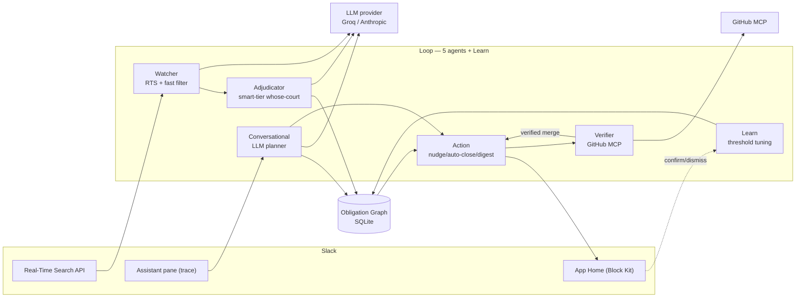

# Loop — Final Demo Bible & Submission Kit

Everything you need to record, present, and submit. The product is built and
award-grade; this is the showcase layer. Read top to bottom on recording day.

---

## 0. TL;DR

- **One-liner:** *Slack shows you messages. Loop shows you obligations — and closes them itself.*
- **Run the demo (only this):** `python -m loop.slack_app` with `LOOP_DEMO_MODE=true`
- **Target track:** New Slack Agent ($8k) → auto-considered for Best UX, Most Innovative, Best Tech.
- **The money moment:** a loop closing *itself* after a GitHub PR merges (record it in a controlled take).

---

## 1. Target awards (be clear-eyed)

Loop is a **single-user personal agent**. Compete where it fits; don't dilute.

| Award | Compete? | Why |
|---|---|---|
| **New Slack Agent** ($8k) | ✅ Primary | New agent; uses all three eligible techs. |
| **Best UX** ($2k) | ✅ | Command-center App Home, carousel, AI-draft modal, zero-state. |
| **Most Innovative** ($2k) | ✅ | Obligation graph + autonomous auto-heal. |
| **Best Technological Implementation** ($2k) | ✅ | 5 agents, all 3 techs, ~394-test suite. |
| Agent for Organizations / Good ($8k each) | ❌ | Need Marketplace submission / social-impact framing. Out of scope. |

Submit once, to **New Slack Agent**. The three specials judge from the same entry.

---

## 2. Positioning (lead the write-up with this)

> **Slack shows you messages. Loop shows you obligations — and closes them itself.**

- **Problem (one line):** *invisible work debt* — the dropped balls you can't see because they're scattered across channels.
- **Wedge (one line):** Inbox apps surface unread messages. Loop surfaces unmet **obligations**, auto-detected with no manual tagging, and resolves them autonomously when the work is verifiably done.

---

## 3. Architecture prompt for Eraser AI (DiagramGPT)

Paste this verbatim into Eraser's **DiagramGPT** (eraser.io → "Create with AI" →
Cloud architecture / Flowchart). Then export PNG/SVG for the submission.

```
Create a clean cloud-architecture flow diagram titled
"Loop — Obligation-Graph Slack Agent".

Use three labeled groups laid left-to-right.

GROUP A "Slack (surfaces & APIs)":
- Real-Time Search API (assistant.search.context)
- App Home (Block Kit: carousel, modal, cards)
- Assistant pane (conversational, tool-use trace)

GROUP B "Loop — 5 cooperating agents + Learn" (center, the core):
- Watcher (Perceive) — RTS sweep + fast-tier LLM filter
- Adjudicator (Reason) — smart-tier LLM, decides whose court the ball is in
- Verifier (Verify) — GitHub MCP pull-request status
- Action Agent (Act) — nudge, auto-close, daily digest
- Conversational Agent (Front door) — LLM planner builds a tool plan
- Learn — confirm/dismiss feedback tunes the confidence threshold

GROUP C "External":
- GitHub MCP server
- LLM provider (Groq / Anthropic, provider-agnostic)

Center datastore:
- Obligation Graph (shared SQLite store) — people as nodes, open loops as directed edges

Connections (label each arrow):
- Real-Time Search API -> Watcher : "candidate messages"
- Watcher -> Adjudicator : "high-recall candidates"
- Adjudicator -> Obligation Graph : "writes obligations + confidence"
- Adjudicator -> LLM provider : "whose-court reasoning"
- Watcher -> LLM provider : "fast classify"
- Obligation Graph -> Action Agent : "surfaced loops"
- Action Agent -> App Home : "renders dashboard"
- Action Agent -> Verifier : "verify before nudge / auto-close"
- Verifier -> GitHub MCP server : "PR merged?"
- Verifier -> Action Agent : "verified merge -> auto-close (heals loop)"
- Assistant pane -> Conversational Agent : "natural-language request"
- Conversational Agent -> LLM provider : "plan tools"
- Conversational Agent -> Obligation Graph : "query"
- Conversational Agent -> Action Agent : "execute plan"
- App Home -> Learn : "confirm / dismiss"
- Learn -> Obligation Graph : "tune threshold"

Style: modern, minimal, rounded nodes, one accent color for the Loop group,
neutral for Slack and External. Emphasize that everything flows through the
single Obligation Graph.
```

### Backup: Mermaid (if you skip Eraser)



Slide caption: *"Five agents, one shared obligation graph, three Slack technologies
(RTS detection, GitHub MCP verification, Slack-AI conversational front door). ~394 automated tests."*

---

## 4. The ONE canonical demo path

Use **only this** for the recording. On demo day, ignore `live_demo.py` (a dev-only
eyeball tool that publishes a static view — it will confuse you under pressure).

```bash
# .env (already set): LOOP_DEMO_MODE=true  LOOP_HOME_LAYOUT=compact  LOOP_USER_ID=<you>
python -m loop.slack_app
```

On boot the app seeds the Northwind org into the live graph with timestamps rebased to
*now*, so every surface is interactive on the polished data.

### Pre-flight checklist (run 30 min before recording)
- [ ] `python -m pytest loop/tests -q` → green (sanity).
- [ ] `python -m loop.slack_app` boots; open Slack → **Loop → Home** shows the dashboard with recent ages.
- [ ] Click one **Nudge** → modal opens; **Cancel** (don't send during setup).
- [ ] Confirm the demo PR `rajj28/loop-demo#2` is **open** on GitHub.
- [ ] Verify MCP token works: `python -m loop.spikes.mcp_probe` (or one rehearsal heal).
- [ ] Close all noisy Slack channels/DMs; set Slack to a clean theme; hide your real DMs.
- [ ] Quit notifications. Full-screen Slack. Record at 1080p+.

---

## 5. The storyboard — what to SHOW and what to SAY (3:00)

> Narration (**SAY**) is verbatim VO you can read. **SHOW** is exactly what's on screen / what to click.

### Beat 1 — The hook (0:00–0:20)
- **SHOW:** Open cold on the App Home. Header reads **"3 people are blocked on you."** Hold still 2 seconds. Slowly scroll the carousel one card.
- **SAY:** *"This is Slack. It's very good at telling you about messages. It has never once told you what you actually owe other people. Loop does — and notice, I didn't tag or flag a single thing. It found these on its own."*

### Beat 2 — How it knows (0:20–1:10) — proves all 3 techs in one shot
- **SHOW:** Click into the **Loop Assistant** pane. Type: **`who is blocked on me?`** Send. When the reply renders, hover/point at the context line: **"Loop's reasoning: Searched workspace → Verified GitHub."**
- **SAY:** *"When I ask Loop a question, it plans which tools to use and shows its work. It swept the whole workspace with Slack's Real-Time Search, used AI to reason about whose court each ball is in, and checked GitHub through MCP — live. That trace is the real record of what the agent did, not a canned string."*

### Beat 3 — Acting as you (1:10–1:55)
- **SHOW:** Back on **Home**. On Alice's card, click **Nudge**. The composer **modal** opens with an AI-written message pre-filled. Edit one word (e.g., add "thanks!"). Click **Send as you**. Then open the Loop DM to show the **"✅ Nudge sent"** confirmation card with the quoted message.
- **SAY:** *"If someone's been waiting, Loop drafts the nudge for me — in my voice — and sends it as me, but only after one tap. I'm always in control. And every action leaves a clean record."*
- **Optional:** Show the hero **"Nudge someone who's waiting…" dropdown** and pick a person — *"or I can nudge anyone in one click."*

### Beat 4 — The magic: auto-heal (1:55–2:35) — THE moment
- **SHOW:** Point at Bob's card: **"Bob is blocked on you merging the widgets PR."** Cut to a GitHub tab; **merge** `rajj28/loop-demo#2`. Cut back to the Loop Home; within a sweep the card **leaves the "Blocked on you" carousel and appears under "Recently auto-closed."**
- **SAY:** *"Here's the part I love. Bob's blocked on a pull request. Watch what happens when I actually merge it. Loop verifies the merge through GitHub MCP, and closes the loop itself — I never touched the dashboard. The work being done is what resolves it."*

### Beat 5 — The payoff (2:35–3:00)
- **SHOW:** Dismiss/close the remaining blocked loops (or cut to the seeded zero-state) so the header reads **"You're all caught up"** with the celebratory line *"🎉 Loop auto-closed 5 loops for you."*
- **SAY:** *"Loop turns invisible work debt into a calm, self-healing list. No new app to check, no manual tagging — it just lives in Slack and keeps your court clear. That's the next era of productivity."*

---

## 6. De-risk the magic moment (single biggest execution risk)

Beat 4 hits the **real GitHub MCP** live. Protect it:
1. **Record it controlled, not live in front of judges.** Merge, capture the heal, re-shoot until crisp.
2. **Pre-warm:** confirm the PR is open and MCP works right before the take.
3. **Bulletproof backup (network-free):** the offline beat reproduces merge → verify → auto-close → feed with zero network and is test-covered (`loop/tests/test_seed_pr_merge_beat.py`, 5/5). If MCP is flaky on the day, demonstrate the logic through it and narrate identically.
4. **Never** bet a take on a live API resolving on camera.

---

## 7. Demo config (make the "AI" reliable on camera)

- **Safest:** keep `LOOP_DEMO_MODE=true`. The dashboard reads the seeded graph, so the reveal/carousel/auto-heal never depend on a live model call.
- **Show live AI where it's strong:** the **Assistant trace** (Beat 2) and the **Nudge draft** (Beat 3) are real LLM calls — rehearse the exact prompt so you've seen it succeed.
- **For the crispest reasoning take:** optionally set `LLM_PROVIDER=anthropic` with a Claude key just for recording (one-line switch; everything is provider-agnostic). Groq Llama is the free default and works, but may occasionally fall back to the deterministic parser.

---

## 8. Judge Q&A prep (have these answers ready)

- **"Is the detection real or scripted?"** Real. The Watcher calls Slack RTS (`assistant.search.context`) on the user token; the Adjudicator reasons with an LLM; results write to the graph. Demo mode seeds a reproducible org so the dashboard is stable on camera, but the same code path runs live.
- **"How does auto-close avoid false 'done'?"** A three-valued Verifier interlock: only a Verifier-confirmed **merged** PR triggers closure; unverified/unknown state **forbids** auto-close. Safety over eagerness.
- **"Does it spam people?"** No. Quiet-by-default (a confidence threshold the Learn loop tunes), and nothing is ever sent as you without an explicit one-tap confirm.
- **"What about privacy?"** Derived obligations stay in the workspace trust boundary; minimal scopes; dismissed loops are never surfaced anywhere.
- **"Why only 3 surfaced when the org is big?"** That's the point — Loop scanned many channels and surfaced only what's genuinely on you. Scale shows in the "scanned N channels" line and the waiting/auto-closed sections.
- **"Roadmap?"** Multi-user/team rollups and non-GitHub artifacts (Jira, Google Docs) via more MCP servers. Today it's a focused, polished personal agent.

---

## 9. What NOT to do now (stop here)

- **Don't add features or tests.** Product is done; more engineering = less time on the submission, which is what wins.
- **Don't keep polishing the UI.** It's award-grade; diminishing returns.
- **Do** spend remaining hours on: the screen recording, the Eraser PNG, and the written description below.

---

## 10. Devpost text description (draft — edit to taste)

**Loop — your obligations, not just your messages.**

Slack is great at telling you about messages. It never tells you what you actually
owe people. Loop is a personal Slack agent that maintains a live **obligation
graph**: every open loop where someone is blocked on you, or you're waiting on
someone — auto-detected from your workspace with zero manual tagging. The signature
reveal: *"N people are blocked on you right now, and you didn't know it."*

**How it works.** Five cooperating agents share one obligation graph:
1. **Watcher** sweeps the workspace using Slack's **Real-Time Search API** and a fast-tier LLM filter (high recall).
2. **Adjudicator** uses an LLM to decide whose court each ball is in, with a confidence score.
3. **Verifier** grounds work in reality via the **GitHub MCP** — is that PR actually merged?
4. **Action Agent** renders the App Home, drafts polite nudges you send with one tap, and **auto-closes loops** the moment their work is verifiably done.
5. **Conversational Agent** is the Slack-AI front door: ask in plain language, and it plans which tools to run and shows its reasoning as a visible tool-use trace.
A **Learn** loop tunes the surfacing threshold from your confirm/dismiss feedback.

**Why it's different.** Inbox tools surface unread messages; Loop surfaces unmet
**obligations** and resolves them autonomously. The dashboard is a calm command
center — a swipeable carousel of who's blocked on you, compact "waiting on others,"
and a feed of loops that closed themselves — with an AI-draft nudge composer and
reversible one-tap actions.

**Built with:** Slack Real-Time Search API, GitHub MCP, Slack AI / Assistant pane,
Block Kit (carousel, modal, cards), Python, a provider-agnostic two-tier LLM stack
(Groq / Anthropic), and a shared SQLite obligation graph — backed by ~394 automated
tests including property-based coverage.

---

## 11. Submission checklist

- [ ] 3-min demo video (storyboard §5); auto-heal captured in a clean take (§6).
- [ ] Architecture diagram exported from Eraser (§3) → PNG attached.
- [ ] Text description (§10), led by the one-sentence pitch.
- [ ] Sandbox access granted to `slackhack@salesforce.com` and `testing@devpost.com`.
- [ ] Submitted to the **New Slack Agent** track before **Jul 14, 2026, 5:30am GMT+5:30**.
